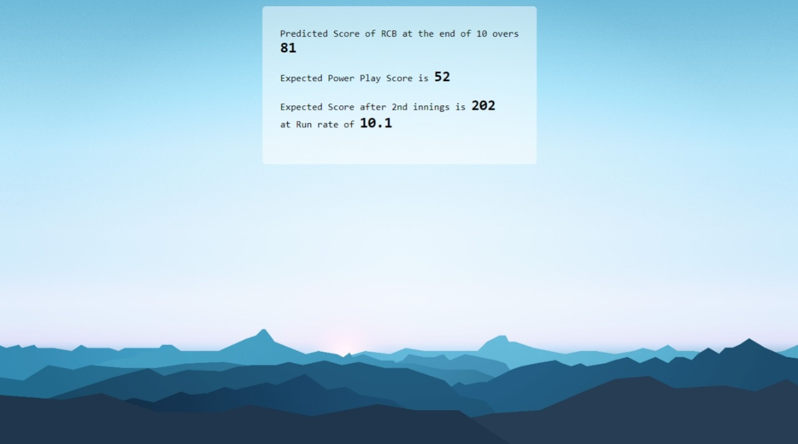

# IPL-Score-Predictor
A web application that utilizes Flask to provide a user interface that forecasts the
score of an IPL team at a given time based on specific inputs using machine learning algorithms.
<p>
  
    
</p>

# How to use

1. Clone this repo.

   ```terminal
   git clone https://github.com/bhanu-73/IPL-Score-Predictor.git
   ```


2. Install the required libraries.

    ```terminal
    pip install -r requirements.txt
    ```

3. Execute main.py.
